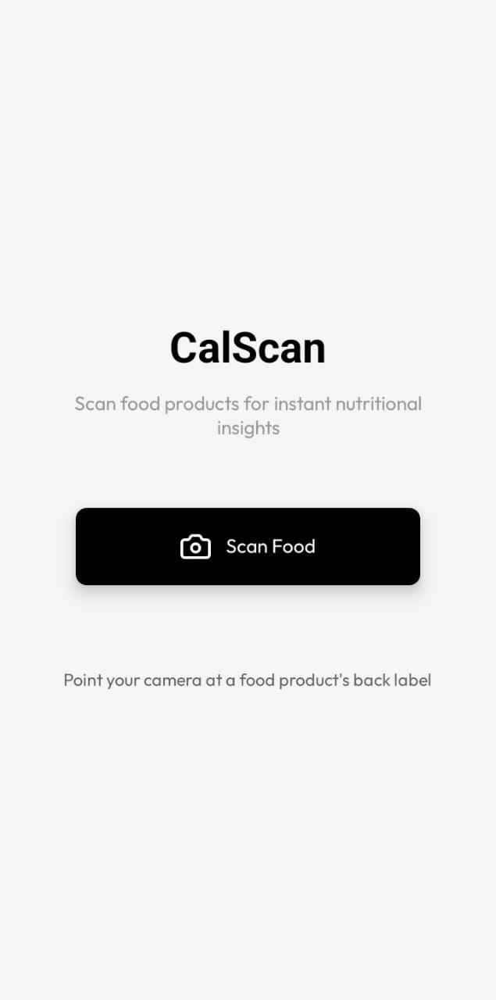
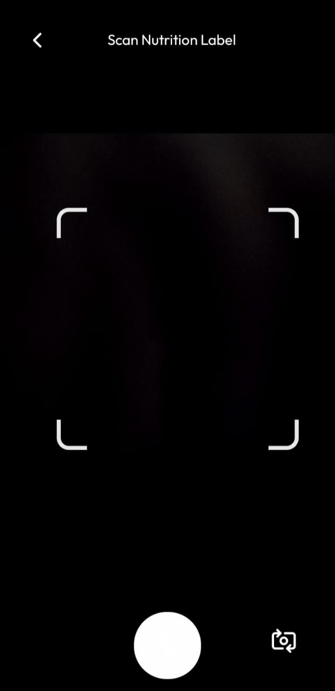

# CalScan - Food Nutrition Scanner

This is a simple food nutrition scanner app built with Expo. It uses your device's camera to scan food product labels and provides nutritional analysis using Google's Gemini 2.0 AI.

## App Preview

<p align="center">
  
  
</p>

## Setup for Development

1. Create a `.env` file in the root directory and add your Gemini API key:
   ```
   EXPO_PUBLIC_GEMINI_API_KEY=your_api_key_here
   ```

2. Install dependencies:
   ```bash
   npm install
   ```

3. Start the app:
   ```bash
   npm start
   ```

## Features

- Camera-based food label scanning
- AI-powered nutritional analysis with Gemini 2.0
- Simple and intuitive interface
- Instant nutritional ratings and ingredient warnings